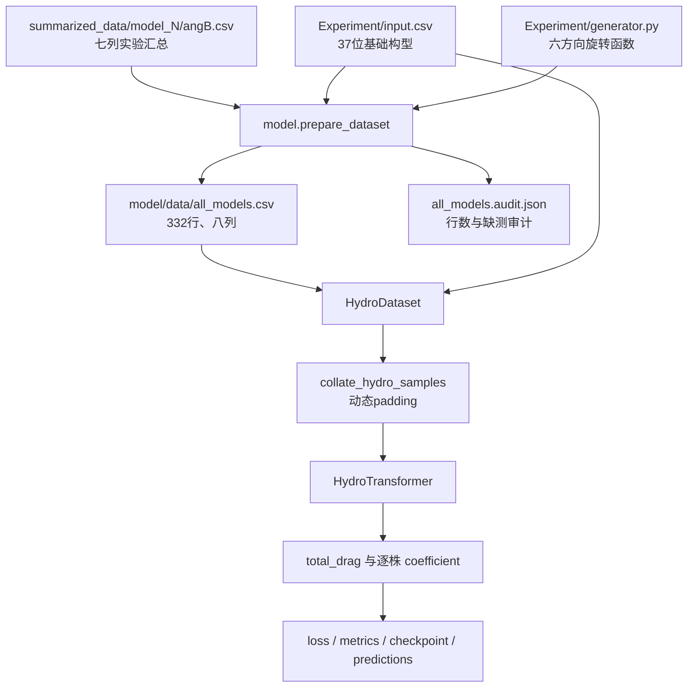
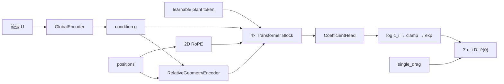

# `model` 文件夹脚本详细说明

## 1. 文档目的与阅读方式

本文档解释 `model/` 文件夹中每个脚本、配置文件、数据文件和测试文件的作用。默认读者只掌握 Python 基础语法，因此第一次出现项目术语时都会解释，并重点说明：

- 一个文件为什么存在；
- 它从哪里读取数据、向哪里写数据；
- 每个主要类、函数和方法接收什么参数；
- 输入和输出 Tensor（张量，多维数值数组）的 shape；
- 函数返回什么、可能抛出什么异常、是否会修改文件或模型状态；
- 从原始汇总数据到模型预测结果的完整调用关系。

推荐按以下顺序阅读：

1. 先读第 2～5 节，建立目录、术语和全流程概念；
2. 如果只想重新生成总 CSV，读第 6～8 节；
3. 如果想理解 Transformer，读第 9～17 节；
4. 如果想训练或评估模型，读第 18～29 节；
5. 遇到错误时查第 32 节。

文中的 `文件.py:起始行-结束行` 是源码位置。代码调整后行号可能移动，应同时根据类名或函数名搜索。

---

## 2. 文件夹结构

```text
model/
├── __init__.py                    # 把 model 标记为 Python package
├── prepare_dataset.py             # 生成八列总 CSV 和审计 JSON
├── train.py                       # overfit、5 折交叉验证、最终重训入口
├── evaluate.py                    # checkpoint 独立评估入口
├── plan.md                        # 模型最初的物理与架构设计方案
├── README.md                      # 面向使用者的快速命令说明
├── 模型文件夹脚本详细说明.md       # 本文档
├── requirements.txt               # Python 依赖
├── configs/
│   └── base.yaml                  # 默认数据、模型和训练参数
├── data/
│   ├── all_models.csv             # 332 条正式训练数据
│   └── all_models.audit.json      # 数据生成审计记录
├── hydro/
│   ├── __init__.py                # 数据层公开接口
│   ├── geometry.py                # 六边形坐标和构型反查
│   └── data.py                    # Dataset 和动态 padding
├── models/
│   ├── __init__.py                # 网络层公开接口
│   ├── global_encoder.py          # 流速条件编码
│   ├── conditional_norm.py        # FiLM 与 Conditional LayerNorm
│   ├── rope_2d.py                 # 二维 RoPE
│   ├── relative_geometry.py       # 成对相对位置编码
│   ├── attention.py               # 水动力多头 Attention
│   ├── transformer_block.py       # 完整 Transformer block
│   ├── coefficient_head.py        # 每株 latent coefficient 输出头
│   └── model.py                   # HydroTransformer 总模型
├── training/
│   ├── __init__.py                # 训练工具公开接口
│   ├── config.py                  # YAML 读取与配置合并
│   ├── splits.py                  # 按 model_id 分组划分
│   ├── losses.py                  # interaction coefficient loss
│   ├── metrics.py                 # 回归指标
│   ├── scheduler.py               # warmup + cosine 学习率
│   ├── checkpoint.py              # 模型状态保存与恢复
│   └── trainer.py                 # 训练循环、预测和产物写出
├── tests/                          # 28 项 pytest 回归测试
└── artifacts/
    └── .gitignore                 # 训练产物目录，不提交到 Git
```

`package` 可以理解为“允许其他 Python 文件使用 `import model...` 导入的代码目录”。目录中的 `__init__.py` 就是 package 标记和公开接口清单。

---

## 3. 需要先理解的术语

### 3.1 样本、构型和工况

- **构型（layout）**：37 个六边形格点中哪些位置安装了水草，用长度 37 的 `01` 字符串表示。
- **model_id**：基础构型编号。例如 `model_5` 对应 `Experiment/input.csv` 第 5 行。
- **angle**：构型相对基础方向顺时针旋转的角度，只允许 `0、60、120、180、240、300`。
- **工况**：一个构型、一个角度和一个流速的组合。
- **样本**：总 CSV 中的一行。当前共有 332 个真实工况，因此有 332 个样本。

### 3.2 Tensor shape 符号

| 符号 | 含义 |
|---|---|
| `B` | batch size，一次送入模型的样本数 |
| `N` | 当前 batch padding 后的最大水草数 |
| `D` | `d_model`，每株水草隐藏特征的维度 |
| `H` | attention head 数量 |
| `Dh` | 每个 head 的维度，`Dh = D / H` |
| `G` | 全局特征数量，当前只有流速，所以 `G=1` |

例如 `positions [B,N,2]` 表示：一个 batch 有 `B` 个样本，每个样本最多 `N` 株水草，每株用二维坐标 `(x,y)` 表示。

### 3.3 训练相关术语

- **batch**：一次计算若干样本，而不是一次只计算一行。
- **epoch**：模型完整遍历一次训练集。
- **step**：优化器更新一次参数。一个 epoch 通常包含多个 step。
- **loss**：训练时要最小化的误差函数。
- **validation**：训练过程中选最佳模型的数据，不参与参数更新。
- **test**：训练完成后报告泛化效果的数据，不能参与调参。
- **checkpoint**：保存模型权重、优化器、学习率调度器、配置和训练进度的文件。
- **overfit 检查**：故意用很少数据训练，确认代码能否把小数据拟合下来。它是排错工具，不是性能结论。
- **latent coefficient**：模型内部学到的潜在系数。只有总阻力监督时，它不能直接解释为真实单株阻力。

---

## 4. 整体数据流



最重要的两条防重复处理规则是：

1. 第八列保存的是已经按 `angle` 旋转后的水草排列，Dataset 不再旋转坐标；
2. `summarized_data` 中的 `FX_0/FY_0` 已经统一到 0° 力坐标系，`prepare_dataset.py` 不再旋转力。

---

## 5. 一行数据如何变成模型输入

总 CSV 表头固定为：

```text
TX,TY,TZ,FX_0,FY_0,FZ,flow_speed,vegetation_layout
```

数据层对一行执行以下转换：

| CSV 信息 | 转换结果 | 是否送入模型 |
|---|---|---|
| `vegetation_layout` | 值为 1 的格点坐标 `positions [N,2]` | 是 |
| 植株数量 `N` | `single_drag [N]`，当前全为 1 | 是 |
| 有效植株位置 | `plant_mask [N]`，当前样本内部全为 `True` | 是 |
| `flow_speed` | `global_features [1]` | 是 |
| `FX_0` | `target_drag=max(FX_0,0)` | 只进入 loss |
| 原始 `FX_0` | `raw_target_drag` | 否，仅审计 |
| 反查出的 `model_id/angle` | 分组、追踪信息 | 否 |
| `TX/TY/TZ/FY_0/FZ` | 保留在总 CSV | 当前模型不使用 |

当不同样本的水草数不同时，`collate_hydro_samples` 会把短样本补到当前 batch 的最大 `N`。补出来的位置必须满足：

```text
positions = 0
single_drag = 0
plant_mask = False
```

模型所有 attention、残差和阻力求和都必须根据 `plant_mask` 忽略这些 padding。

---

## 6. `prepare_dataset.py`：生成八列总数据

### 6.1 文件职责

`model/prepare_dataset.py` 扫描 `summarized_data/model_N/angB.csv`，读取 `Experiment/input.csv` 中对应的基础构型，复用 `Experiment/generator.py` 的旋转函数，最后生成：

- `model/data/all_models.csv`；
- `model/data/all_models.audit.json`。

默认运行命令：

```powershell
py -3.11 -m model.prepare_dataset
```

该命令会覆盖这两个生成文件，但会先完成全部校验，避免写出半成品。

### 6.2 导入模块

| 导入 | 作用 |
|---|---|
| `argparse` | 定义和解析命令行参数 |
| `csv` | 读取源 CSV、构型 CSV，并写总 CSV |
| `importlib.util` | 根据文件路径动态加载 `Experiment/generator.py` |
| `json` | 写审计报告 |
| `re` | 用正则表达式识别 `model_N` 和 `angB.csv` |
| `Counter` | 统计 model、angle、flow speed 的样本数 |
| `Path` | 可靠处理 Windows 路径 |
| `Callable/Sequence` | 类型注解，不参与数值计算 |

脚本没有额外导入 `math`；有限数检查直接用“值是否等于自身”识别 NaN，并用
`abs(value) == float("inf")` 识别正负无穷大。

### 6.3 顶部常量

`prepare_dataset.py:15-38` 集中定义默认路径和数据契约：

- `PROJECT_ROOT`：根据脚本位置推导项目根目录；
- `DEFAULT_SOURCE_ROOT`：默认 `summarized_data/`；
- `DEFAULT_INPUT_CSV`：默认 `Experiment/input.csv`；
- `DEFAULT_OUTPUT_CSV`：默认总 CSV；
- `DEFAULT_AUDIT_JSON`：默认审计 JSON；
- `SOURCE_COLUMNS`：源文件的七列；
- `OUTPUT_COLUMNS`：七列加 `vegetation_layout`；
- `VALID_ANGLES`：六种合法角度；
- `VALID_FLOW_SPEEDS`：`0.1～0.4`；
- `EXPECTED_ROW_COUNT=332`：当前真实样本基线；
- `EXPECTED_MODEL_IDS=1～14`：当前有实验数据的 model；
- `EXPECTED_MISSING_CONDITIONS`：四个已知缺测工况。

### 6.4 `_load_rotation_function(experiment_dir)`

位置：`prepare_dataset.py:41-64`。

- **参数**：`experiment_dir: Path`，即 `Experiment/` 目录。
- **返回值**：`get_rotated_groups` 函数。该函数接收一组 37 位构型，返回六个旋转构型。
- **实现**：根据 `generator.py` 的绝对路径创建模块规格，再执行模块并取得目标函数。
- **可能异常**：
  - 文件不存在：`FileNotFoundError`；
  - 无法建立模块：`ImportError`；
  - 模块中缺少函数：`AttributeError`。
- **副作用**：执行一次模块加载，但不写文件。

动态加载的原因是 `Experiment/` 不是 `model` 子 package，不能依赖当前终端目录做普通相对导入。

### 6.5 `load_base_layouts(input_csv)`

位置：`prepare_dataset.py:67-96`。

- **参数**：`input_csv: Path`，无表头、每行 37 列的构型表。
- **返回值**：`list[list[int]]`，外层列表按行保存 model，内层列表保存 37 个 `0/1`。
- **关键规则**：列表第 0 项对应 `model_1`，因此访问 `model_N` 时使用下标 `N-1`。
- **校验**：不能为空、每行必须 37 列、每项必须是整数 `0/1`。
- **副作用**：只读文件。

### 6.6 `encode_layout(layout)`

位置：`prepare_dataset.py:99-103`。

- **参数**：长度 37 的整数序列。
- **返回值**：长度 37 的字符串，例如 `"100101...001"`。
- **异常**：长度错误或出现非 `0/1` 时抛 `ValueError`。
- **副作用**：无。

构型列必须按字符串读取，不能把它当普通十进制整数处理。

### 6.7 `_numeric_source_paths(source_root)`

位置：`prepare_dataset.py:106-126`。

- **参数**：`summarized_data` 根目录。
- **返回值**：`list[tuple[int,int,Path]]`，每项为 `(model_id, angle, 文件路径)`。
- **排序**：按数字而不是字符串排序，防止 `model_10` 排在 `model_2` 前面。
- **异常**：目录不存在或没有合法文件时抛错。
- **忽略内容**：不符合 `model_N/angB.csv` 命名的临时文件不会进入数据集。

### 6.8 `_read_source_rows(source_file)`

位置：`prepare_dataset.py:129-164`。

- **参数**：单个 `angB.csv` 路径。
- **返回值**：按流速从小到大排序的七列字符串行。
- **校验**：
  - 每行必须七列；
  - 每个值必须可转成有限浮点数；
  - 流速必须属于四个允许值；
  - 同一文件不能重复一个流速；
  - 文件不能是空文件。
- **副作用**：只读文件。

保留字符串而不是把所有数重新格式化，可以让前七列尽量保持上游汇总文件的文本精度。

### 6.9 `prepare_dataset(...)`

位置：`prepare_dataset.py:167-291`。

参数：

| 参数 | 类型 | 默认值 | 含义 |
|---|---|---|---|
| `source_root` | `Path` | `summarized_data/` | 七列源文件根目录 |
| `input_csv` | `Path` | `Experiment/input.csv` | 基础构型表 |
| `output_csv` | `Path` | `model/data/all_models.csv` | 总 CSV 输出路径 |
| `audit_json` | `Path` | `model/data/all_models.audit.json` | 审计报告路径 |
| `strict` | `bool` | `True` | 是否强制当前 332 行基线 |

- **返回值**：包含数据统计、缺测清单和检查结果的审计字典。
- **副作用**：全部检查通过后创建父目录并覆盖两个输出文件。
- **不会执行**：不会插值、复制或补齐缺测工况。

主流程按以下顺序工作：

1. 读取 17 个基础构型；
2. 数值排序全部源文件；
3. 从 `model_N` 取得第 N 行构型；
4. 用 `angle/60` 选择旋转结果；
5. 读取该角度下真实存在的流速行；
6. 在每行末尾追加旋转后的 37 位构型；
7. 校验旋转前后植株数量一致、工况没有重复；
8. 严格模式检查 14 个 model、84 个角度文件、332 行和四个已知缺测；
9. 写 CSV，再写审计 JSON。

### 6.10 CLI 函数

`build_argument_parser()` 位于 `prepare_dataset.py:294-306`：

- 不接收参数；
- 返回配置好的 `argparse.ArgumentParser`；
- 提供四个路径参数和 `--no-strict`。

`main(argv=None)` 位于 `prepare_dataset.py:309-324`：

- `argv=None` 时读取真实命令行；测试时可以传入字符串列表；
- 调用 `prepare_dataset`；
- 打印生成行数和文件路径；
- 返回 `None`。

---

## 7. `hydro/geometry.py`：构型和物理坐标

### 7.1 坐标约定

该文件将 37 个格点排成 `4-5-6-7-6-5-4` 七行：

```text
实验 +x：向上
实验 +y：向左
中心点 18：(0, 0)
相邻点距离：1 个无量纲网格单位
```

注意“距离 1”不是 1 米。在实际格点间距测量完成前，位置保持无量纲。

### 7.2 导入模块和常量

- `csv`：读取基础构型；
- `importlib.util`：动态加载旋转函数；
- `math`：计算 `sqrt(3)`；
- `Path`：路径处理；
- `Callable/Sequence`：类型注解。

常量位于 `geometry.py:12-15`：

- `ROW_LENGTHS=(4,5,6,7,6,5,4)`；
- `POINT_COUNT=37`；
- `VALID_ANGLES` 为六种旋转角度。

### 7.3 `build_hex_coordinates()`

位置：`geometry.py:18-34`。

- **参数**：无。
- **返回值**：37 个 `(x,y)` 的列表，顺序与构型位序完全一致。
- **公式**：
  - `x=(3-row_index)*sqrt(3)/2`；
  - `y=(row_length-1)/2-column_index`。
- **异常**：若内部生成点数不是 37，会触发 `AssertionError`。
- **副作用**：无。

### 7.4 `parse_layout(layout)`

位置：`geometry.py:37-48`。

- **参数**：37 位字符串，或包含 37 个整数的序列。
- **返回值**：`tuple[int,...]`。tuple 不可修改，可安全用作字典键。
- **异常**：长度错误、非法字符或非 `0/1` 数值会抛 `ValueError`。
- **副作用**：无。

### 7.5 `layout_to_positions(layout, coordinates=None)`

位置：`geometry.py:51-68`。

- **参数**：
  - `layout`：37 位构型；
  - `coordinates`：可选的自定义 37 点坐标，默认调用 `build_hex_coordinates()`。
- **返回值**：只保留构型值为 1 的坐标列表。
- **顺序**：仍按点位编号排序，保证结果可复现。
- **异常**：坐标不是 37 个时抛 `ValueError`。
- **重要行为**：此函数不会旋转构型，因为总 CSV 第八列已经是对应角度的排列。

### 7.6 `_load_rotation_function(generator_path)`

位置：`geometry.py:71-83`。作用与 `prepare_dataset.py` 的动态加载类似，但参数直接是 `generator.py` 路径。返回 `get_rotated_groups`，可能抛 `FileNotFoundError`、`ImportError` 或 `AttributeError`。

### 7.7 `build_layout_index(input_csv_path)`

位置：`geometry.py:86-125`。

- **参数**：`Experiment/input.csv` 路径。
- **返回值**：`dict[str, tuple[int,int]]`，键是 37 位旋转构型，值是 `(model_id, angle)`。
- **当前规模**：17 个构型 × 6 个角度 = 102 个唯一键。
- **用途**：总 CSV 不增加 `model_id` 和 `angle` 列，Dataset 通过第八列反查这两个元数据。
- **异常**：若两个 model/angle 产生相同构型，会抛 `ValueError`，因为这种情况下无法唯一分组。

---

## 8. `hydro/data.py`：Dataset 和动态 padding

### 8.1 导入与数据契约

- `csv.DictReader`：根据表头读取八列；
- `Path`：保存绝对数据路径；
- `torch`、`Tensor`：创建模型输入张量；
- `Dataset`：实现 PyTorch 标准数据集接口；
- `build_layout_index`：反查 model 和 angle；
- `layout_to_positions`：筛选水草坐标；
- `parse_layout`：严格解析 37 位构型。

`DATASET_COLUMNS` 位于 `data.py:16-26`，要求表头完全一致。`SUPPORTED_NEGATIVE_TARGET_POLICIES` 当前只有 `clamp_to_zero`。

### 8.2 `HydroDataset.__init__(...)`

位置：`data.py:45-66`。

| 参数 | 类型 | 含义 |
|---|---|---|
| `csv_path` | `str/Path` | 八列总 CSV |
| `input_csv_path` | `str/Path` | 基础构型表，用于反查元数据 |
| `dtype` | `torch.dtype` | 浮点 Tensor 类型，默认 `float32` |
| `negative_target_policy` | `str` | 负标签策略，当前只能是 `clamp_to_zero` |

构造时会立即读取全部 332 行并保存到内存，不是调用 `__getitem__` 时才读磁盘。未知负标签策略会在文件访问前立即抛 `ValueError`。

### 8.3 `_load_samples()`

位置：`data.py:68-123`。

它逐行创建以下字典：

```python
{
    "positions": Tensor[N, 2],
    "single_drag": Tensor[N],
    "plant_mask": BoolTensor[N],
    "global_features": Tensor[1],
    "target_drag": scalar Tensor,
    "raw_target_drag": scalar Tensor,
    "model_id": int,
    "angle": int,
    "flow_speed": float,
    "source_index": int,
}
```

关键处理：

- `single_drag` 当前为全 1，占位表示每株孤立阻力相同；
- `plant_mask` 在单样本内全 `True`，padding 在组 batch 时才产生；
- `global_features` 当前只有流速 `U`；
- `target_drag=max(FX_0,0)`；
- `raw_target_drag` 保留未经修改的 `FX_0`；
- 第八列无法在索引中找到时立即报错；
- 不允许 NaN、无穷大、空构型或空数据集。

当前有四个很小的负 `FX_0` 被训练标签归零，但原始值仍可从 `raw_target_drag` 和总 CSV 找回。

四条记录全部位于 `0.1 m/s`：

| `source_index` | CSV 文本行 | 原始 `FX_0` |
|---:|---:|---:|
| 12 | 14 | -0.0214401224 |
| 70 | 72 | -0.0142329137 |
| 94 | 96 | -0.0235408693 |
| 106 | 108 | -0.0268076279 |

“归零”是当前项目根据数值量级作出的建模决定，不等于已经通过传感器精度或测量不确定度证明它们必然是噪声。当前文档没有可靠的传感器不确定度和力单位，因此正式研究应补做敏感性分析，例如比较：保留原值、归零、排除记录或使用稳健 loss 时的结果变化。

### 8.4 Python Dataset 标准方法

`__len__()` 位于 `data.py:125-127`：无参数，返回样本数 332。

`__getitem__(index)` 位于 `data.py:129-131`：

- 参数是从 0 开始的整数索引；
- 返回已经加载的样本字典；
- 越界时由 Python 列表抛 `IndexError`。

### 8.5 `collate_hydro_samples(samples)`

位置：`data.py:134-173`。

- **参数**：一个或多个样本字典组成的序列。
- **返回值**：一个 batch 字典。
- **异常**：空序列抛 `ValueError`；字段缺失会产生 `KeyError`。

返回主要 shape：

```text
positions       [B, Nmax, 2]
single_drag     [B, Nmax]
plant_mask      [B, Nmax]
global_features [B, 1]
target_drag     [B]
其他元数据       [B]
```

实现先创建全零大 Tensor，再把第 `b` 个样本的前 `N_b` 项填入。`plant_mask=False` 的位置是 padding，不是真实的中心水草。

`hydro_collate_fn` 只是 `collate_hydro_samples` 的别名，方便写成：

```python
DataLoader(dataset, collate_fn=hydro_collate_fn)
```

### 8.6 `hydro/__init__.py`

该文件公开以下稳定接口：

```python
from model.hydro import (
    HydroDataset,
    build_hex_coordinates,
    build_layout_index,
    collate_hydro_samples,
    hydro_collate_fn,
    layout_to_positions,
)
```

下划线开头的内部函数没有公开，不建议外部脚本依赖。

---

## 9. Transformer 核心总览

完整模型定义在 `models/model.py`，底层由多个小模块组合。拆开的好处是每个物理机制都能独立测试和关闭，从而进行 ablation（消融实验，即逐项关闭模块比较贡献）。



模型不把 `(x,y)` 直接拼接到 plant token 中。位置只通过以下两条路径进入：

1. 2D RoPE 改变 attention 的 Query/Key；
2. Relative Value 把 `source-target` 的成对几何加入消息。

---

## 10. `models/global_encoder.py`：全局条件编码

### 10.1 `GlobalEncoder`

这个模块把全局物理量转换成与模型隐藏维度相同的条件向量。当前全局物理量只有标准化后的流速。

构造函数位于 `global_encoder.py:15-21`：

| 参数 | 含义 |
|---|---|
| `input_dim` | 输入全局特征数 `G`，当前为 1 |
| `hidden_dim` | 中间层维度，默认配置为 64 |
| `output_dim` | 输出维度，通常等于 `d_model=256` |

网络结构：

```text
Linear(G → hidden_dim)
SiLU
Linear(hidden_dim → D)
```

`SiLU` 是平滑激活函数，作用类似 ReLU，但负值区域不是直接归零。

`forward(global_features)` 位于 `global_encoder.py:23-26`：

- 输入 `[B,G]`；
- 返回条件向量 `[B,D]`；
- shape 错误通常由 `nn.Linear` 抛出 `RuntimeError`；
- 不修改输入。

---

## 11. `models/conditional_norm.py`：FiLM 和条件归一化

### 11.1 FiLM 是什么

FiLM 是 Feature-wise Linear Modulation，中文可理解为“按特征维度进行线性调制”。公式为：

```text
output = (1 + gamma(condition)) * features + beta(condition)
```

`gamma` 调整特征幅度，`beta` 调整偏移。这里的 condition 来自流速编码，因此同一种几何关系可以随流速改变。

### 11.2 `FeatureWiseLinearModulation`

构造函数位于 `conditional_norm.py:20-25`：

- `condition_dim`：条件向量最后一维；
- `feature_dim`：被调制特征最后一维。

内部 `Linear(condition_dim, 2*feature_dim)` 同时产生 gamma 和 beta。weight 与 bias 全部初始化为 0，因此模型刚创建时：

```text
gamma = 0
beta = 0
output = features
```

这就是“零初始化 FiLM”，保证条件模块不会在训练开始前随意破坏特征。

`parameters_from_condition(condition)` 位于 `conditional_norm.py:27-31`：

- 输入 `[B,C]`；
- 返回 `(gamma, beta)`，二者都是 `[B,F]`。

`forward(features, condition)` 位于 `conditional_norm.py:33-44`：

- `features` 可以是 `[B,N,F]`、`[B,H,N,F]` 或其他最后一维为 `F` 的张量；
- 方法自动在 gamma/beta 中插入若干长度为 1 的维度以完成 broadcasting（广播，即自动扩展维度参与逐项计算）；
- 返回 shape 与 `features` 完全相同。

### 11.3 `ConditionalLayerNorm`

构造参数位于 `conditional_norm.py:57-70`：

- `feature_dim`：被归一化的最后一维；
- `condition_dim`：全局条件维度；
- `enabled`：是否实际使用 FiLM；
- `eps`：LayerNorm 防止除零的小常数，默认 `1e-5`。

`forward(features, condition)` 位于 `conditional_norm.py:72-78`：

1. 对 `features` 最后一维做普通 LayerNorm；
2. `enabled=True` 时再执行 FiLM；
3. 关闭时直接返回普通 LayerNorm 结果。

即使关闭，FiLM 层也仍会实例化，只在 forward 中旁路。这样相同 seed 下的消融模型不会因为“少创建一个 Linear”而改变后续公共参数的随机初始化顺序。

---

## 12. `models/rope_2d.py`：二维旋转位置编码

### 12.1 RoPE 的用途

RoPE 是 Rotary Position Embedding。它把坐标变成旋转角度，再旋转 Query 和 Key 的通道。这样 attention 点积能感知相对位置，同时不需要把坐标直接塞进 token。

本项目中每个 head 的通道分成两半：

```text
前 Dh/2：编码实验 x，即顺流方向
后 Dh/2：编码实验 y，即横向
```

每一半内部又按偶数/奇数通道组成旋转对，所以启用 RoPE 时 `head_dim` 必须是 4 的倍数。

### 12.2 `_apply_axis_rope(values, coordinate, base)`

位置：`rope_2d.py:9-33`。

- `values`：`[B,H,N,axis_dim]`；
- `coordinate`：`[B,N]`；
- `base`：频率底数，默认 10000；
- 返回与 `values` 相同 shape 的旋转结果。

函数把相邻偶/奇通道看成二维向量 `(a,b)`，按坐标相关角度计算：

```text
a' = a*cos(theta) - b*sin(theta)
b' = a*sin(theta) + b*cos(theta)
```

下划线表示这是模块内部函数，正确性依赖外层已经保证 axis 维度是偶数。

### 12.3 `RotaryPositionEmbedding2D`

构造参数位于 `rope_2d.py:45-52`：

- `head_dim`：每个 attention head 的维度；
- `base=10000.0`：频率底数；
- `enabled=True`：RoPE 消融开关。

仅启用时检查 `head_dim % 4 == 0`，否则抛 `ValueError`。关闭 RoPE 的 vanilla Transformer 不受该约束。

`forward(query, key, positions)` 位于 `rope_2d.py:55-68`：

- `query/key` 输入和输出均为 `[B,H,N,Dh]`；
- `positions` 为 `[B,N,2]`；
- 只旋转 Q/K，不旋转 V；
- 关闭时原样返回 Q/K。

---

## 13. `models/relative_geometry.py`：成对相对几何

### 13.1 `compute_relative_positions(positions)`

位置：`relative_geometry.py:9-22`。

- **参数**：`positions [B,N,2]`。
- **返回值**：`relative [B,N,N,2]`。
- **方向定义**：`relative[b,i,j] = p_j - p_i`。

第一个 `N` 是 target plant（正在接收信息的水草），第二个 `N` 是 source plant（提供信息的水草）。因为来流沿 `+x`：

```text
dx_ij = x_j - x_i < 0  → source j 在 target i 上游
dx_ij > 0              → source j 在 target i 下游
```

方向不能写反，否则模型学到的尾流方向会与物理约定相反。

### 13.2 `RelativeGeometryEncoder`

构造参数位于 `relative_geometry.py:37-61`：

| 参数 | 含义 |
|---|---|
| `n_heads` | attention head 数 |
| `head_dim` | 每个 head 的 Value 维度 |
| `hidden_dim` | 几何 MLP 中间维度 |
| `condition_dim` | 全局条件维度 |
| `enabled` | 是否启用 relative Value |
| `condition_on_global` | 是否用流速 FiLM 调制 relative Value |

内部几何 MLP：

```text
[dx, dy, r]
→ Linear(3, hidden_dim)
→ SiLU
→ Linear(hidden_dim, H*Dh)
```

`forward(positions, condition)` 位于 `relative_geometry.py:63-84`：

1. 计算 `[dx,dy]`；
2. 计算距离 `r=sqrt(dx²+dy²)`；
3. 拼成 `[B,N,N,3]`；
4. MLP 编码为每个 head 的 relative Value；
5. 可选执行全局 FiLM；
6. FiLM 之后再把 self-edge `i==j` 强制设为 0；
7. 返回 `[B,H,N,N,Dh]`。

关闭模块时直接返回同 shape 的全零张量。成对张量的内存复杂度与 `N²` 成正比；当前最多十余株影响不大，但扩展到数百株时会成为显存瓶颈。

---

## 14. `models/attention.py`：水动力多头 Attention

### 14.1 `_safe_masked_softmax(scores, source_mask, target_mask)`

位置：`attention.py:14-27`。

参数：

- `scores [B,H,N,N]`：QK attention 分数；
- `source_mask [B,N]`：哪些 source 是真实植物；
- `target_mask [B,N]`：哪些 target 是真实植物。

返回 `[B,H,N,N]` attention 权重。

普通 masked softmax 在全 padding 时可能对一整行负无穷做 softmax，得到 NaN。本函数改用以下安全步骤：

1. 无效 source 分数换成当前 dtype 的有限最小值；
2. softmax；
3. 无效 source 权重乘 0；
4. 对有效权重重新归一化；
5. 无效 target 整行乘 0。

因此全 padding batch 也会稳定返回全零。

### 14.2 `HydroMultiHeadAttention.__init__(...)`

位置：`attention.py:46-87`。

主要参数：

- `d_model`、`n_heads`、`dropout`；
- `condition_dim`；
- `relative_hidden_dim`、`rope_base`；
- `use_rope`；
- `use_relative_value`；
- `condition_value_on_global`；
- `condition_relative_value_on_global`。

构造时创建：

- `q_proj/k_proj/v_proj/out_proj` 四个 Linear；
- 普通 V 的 FiLM；
- `RotaryPositionEmbedding2D`；
- `RelativeGeometryEncoder`；
- attention 权重 Dropout。

`d_model` 必须能整除 `n_heads`，否则无法平均拆 head，会抛 `ValueError`。

### 14.3 `_split_heads(features)`

位置：`attention.py:89-93`。

把 `[B,N,D]` reshape 和转置成 `[B,H,N,Dh]`。该步骤只改变张量视图和维度顺序，不改变数值含义。

### 14.4 `forward(...)`

位置：`attention.py:95-136`。

输入：

| 参数 | shape | 含义 |
|---|---|---|
| `hidden_states` | `[B,N,D]` | 每株当前隐藏特征 |
| `positions` | `[B,N,2]` | 实验坐标 |
| `condition` | `[B,D]` | 流速条件向量 |
| `plant_mask` | `[B,N]` | `True` 表示真实植物 |
| `return_attention` | bool | 是否返回权重用于分析 |

默认返回 `output [B,N,D]`；开启分析时返回 `(output, attention)`，其中 attention 为 `[B,H,N,N]`。

完整计算顺序：

1. Linear 得到 Q、K、V；
2. 拆分多个 head；
3. 可选用 condition FiLM 调制普通 V；
4. 对 Q/K 使用二维 RoPE；
5. 计算 `scores = Q @ K^T / sqrt(Dh)`；
6. 使用安全 masked softmax；
7. 训练模式下对 attention 权重做 Dropout；
8. 计算普通消息 `Σ_j A_ij V_j`；
9. 计算相对消息 `Σ_j A_ij R_ij^V`；
10. 两种消息相加，合并 heads；
11. 经过输出投影；
12. 将 padding target 清零。

返回用于分析的 attention 是 Dropout 之前的权重，因此同一模型在 `eval()` 下可稳定可视化。

注意：当前源码类说明中仍有一句“输出投影后的 dropout”，但实际输出投影后没有第二次 Dropout；残差路径只在 `transformer_block.py` 中执行一次。理解行为时应以 forward 实现为准。

---

## 15. `models/transformer_block.py`：Pre-LN Block

`HydroTransformerBlock` 把条件归一化、attention、残差连接和 FFN 组合成一层。

### 15.1 构造参数

位置：`transformer_block.py:17-57`。

除模型维度和五个消融开关外，还接收：

- `ffn_dim`：FFN 中间层维度；
- `dropout`：attention 权重、残差和 FFN dropout 概率；
- `relative_hidden_dim`、`rope_base`。

内部 FFN 结构为：

```text
Linear(D → ffn_dim)
SiLU
Dropout
Linear(ffn_dim → D)
```

### 15.2 `forward(...)`

位置：`transformer_block.py:60-92`。

输入是 `hidden_states、positions、condition、plant_mask、return_attention`，shape 与 attention 相同。

Pre-LN 表示“先归一化，再进入子层”：

```text
normalized = ConditionalLayerNorm(hidden_states)
message = Attention(normalized)
hidden_states = hidden_states + Dropout(message)

normalized = ConditionalLayerNorm(hidden_states)
ffn_output = FFN(normalized)
hidden_states = hidden_states + Dropout(ffn_output)
```

每次 residual（残差相加）后都会再次乘 `plant_mask`，防止 Linear bias 让 padding 位置重新出现非零值。

---

## 16. `models/coefficient_head.py`：逐株系数头

### 16.1 `CoefficientHead`

构造函数位于 `coefficient_head.py:13-19`：

- `d_model`：输入隐藏维度；
- `hidden_dim=128`：中间维度。

结构：

```text
Linear(D → hidden_dim)
SiLU
Linear(hidden_dim → 1)
```

最后一层的 weight 和 bias 全部初始化为 0。

`forward(hidden_states)` 位于 `coefficient_head.py:21-24`：

- 输入 `[B,N,D]`；
- 返回 raw `log_coefficient [B,N]`；
- 方法本身不做 clamp、exp 或 mask，这些工作由总模型负责。

零初始化意味着模型创建后：

```text
log(c_i) = 0
c_i = exp(0) = 1
```

于是初始总阻力等于所有单株独立阻力之和，代表“尚未学习水草间耦合修正”。

---

## 17. `models/model.py`：完整 `HydroTransformer`

### 17.1 `HydroTransformerConfig`

这是冻结的 dataclass（数据类），位于 `model.py:15-38`。冻结表示创建后不能原地修改字段。

| 字段 | 默认值 | 含义 |
|---|---:|---|
| `global_input_dim` | 1 | 全局输入特征数 |
| `global_hidden_dim` | 64 | GlobalEncoder 中间维度 |
| `d_model` | 256 | token 隐藏维度 |
| `n_heads` | 8 | attention head 数 |
| `n_layers` | 4 | Transformer block 数 |
| `ffn_dim` | 1024 | FFN 中间维度 |
| `dropout` | 0.05 | dropout 概率 |
| `relative_hidden_dim` | 64 | 几何 MLP 中间维度 |
| `coefficient_hidden_dim` | 128 | 系数头中间维度 |
| `rope_base` | 10000 | RoPE 频率底数 |
| `log_coefficient_min/max` | -5/5 | exp 前的安全截断 |
| 五个 `use/condition` 字段 | True | 消融开关 |

### 17.2 `HydroTransformer.__init__(config=None, **overrides)`

位置：`model.py:53-97`。

- `config`：可选的 `HydroTransformerConfig`；不传时使用默认配置；
- `overrides`：按字段名覆盖配置，例如 `HydroTransformer(d_model=64)`；
- 同时传入时 override 优先；
- 未知字段抛 `TypeError`；
- `n_layers<1` 或 coefficient 截断范围非法时抛 `ValueError`。

构造时创建：

1. 一个 `[D]` learnable plant token；
2. GlobalEncoder；
3. `n_layers` 个 Transformer block；
4. CoefficientHead。

plant token 是所有水草共享的可学习初始向量。由于当前水草种类和材料特征相同，不为每个数组位置创建不同 embedding。

### 17.3 `_validate_inputs(...)`

位置：`model.py:99-115`。

检查：

- `positions` 必须 `[B,N,2]`；
- `single_drag`、`plant_mask` 必须与 `[B,N]` 一致；
- `global_features` 必须是 `[B,G]`；
- mask dtype 必须是 `torch.bool`。

不满足时抛 `ValueError` 或 `TypeError`，让错误在复杂矩阵计算前出现。

### 17.4 `forward(...)`

位置：`model.py:117-187`。

公开接口：

```python
output = model(
    positions=positions,
    single_drag=single_drag,
    global_features=global_features,
    plant_mask=plant_mask,
    return_attention=False,
)
```

输入：

| 参数 | shape | dtype |
|---|---|---|
| `positions` | `[B,N,2]` | float |
| `single_drag` | `[B,N]` | float |
| `global_features` | `[B,G]` | float |
| `plant_mask` | `[B,N]` | bool |
| `return_attention` | 标量 | bool |

流程：

1. 校验输入；
2. 把 `[D]` plant token 扩展到 `[B,N,D]`；
3. 立即清零 padding token；
4. `GlobalEncoder([B,G]) → condition [B,D]`；
5. 依次经过四个 block；
6. 系数头得到 raw log coefficient；
7. clamp 到 `[-5,5]`；
8. `exp` 保证真实 coefficient 大于 0；
9. padding coefficient 和 log coefficient 设为 0；
10. 计算 `total_drag = Σ coefficient * single_drag * mask`。

默认返回：

```python
{
    "total_drag": Tensor[B],
    "coefficient": Tensor[B,N],
    "log_coefficient": Tensor[B,N],
}
```

当 `return_attention=True` 时额外返回：

```python
"attention": list[Tensor[B,H,N,N]]
```

列表长度等于 `n_layers`。

padding 的 `log_coefficient=0` 只是便于保存的占位值；它不能按数学方式理解成 `log(0)`。padding coefficient 已被 mask 成 0，不参与总阻力。

### 17.5 `models/__init__.py` 和 `model/__init__.py`

`models/__init__.py` 汇总公开接口，因此推荐：

```python
from model.models import HydroTransformer, HydroTransformerConfig
```

而不是让业务代码依赖更深的文件路径。`model/__init__.py` 目前只负责把目录标记为 package，不在顶层重新导出类。

---

## 18. `configs/base.yaml`：默认实验配置

YAML 是便于人阅读的配置格式。`base.yaml` 分成五部分：

### 18.1 `seed`

`seed: 20260814` 控制 Python、NumPy、PyTorch 初始化以及数据划分随机性。相同代码、设备和依赖版本下，相同 seed 用于提高结果可复现性。

### 18.2 `data`

- `csv_path`：八列总 CSV；
- `input_csv_path`：基础构型文件；
- `negative_target_policy`：当前固定 `clamp_to_zero`。

YAML 中的相对路径按项目根目录解释，不按配置文件目录解释。

### 18.3 `model`

对应 `HydroTransformerConfig` 的常用字段。没有写进 YAML 的字段由 dataclass 默认值补全，checkpoint 会保存补全后的完整配置，而不是只保存 YAML 中出现的字段。

### 18.4 `training`

- `batch_size=32`；
- `learning_rate=3e-4`；
- `weight_decay=1e-4`；
- `max_epochs=500`；
- `early_stopping_patience=50`；
- `gradient_clip=1.0`；
- `num_workers=0`，适合 Windows；
- `device=auto`，优先 CUDA，否则 CPU。

### 18.5 `cross_validation` 和 `output`

- `n_splits=5`：外层五折；
- `validation_fraction=0.2`：从每折剩余 model groups 中再取约 20% 做 validation；
- `artifact_dir=model/artifacts`：训练产物根目录。

---

## 19. `training/config.py`：读取和保存配置

### 19.1 `DEFAULT_CONFIG`

位置：`config.py:13-48`。这是 Python 字典形式的完整默认配置。即使 YAML 只写少数字段，也能通过递归合并得到可运行配置。

### 19.2 `_deep_merge(base, override)`

位置：`config.py:51-60`。

- **参数**：基础字典和覆盖字典；
- **返回值**：深复制后的新字典；
- **行为**：两个值都是字典时递归合并，否则 override 整体替换 base；
- **副作用**：不修改传入字典。

使用 `copy.deepcopy` 是为了避免一次实验修改全局默认字典，污染下一次实验。

### 19.3 `load_config(path)`

位置：`config.py:63-72`。

- `path=None`：返回默认配置副本；
- 传路径：用 `yaml.safe_load` 读取，再和默认配置合并；
- 顶层不是字典时抛 `ValueError`；
- 返回普通 `dict[str,Any]`。

`safe_load` 不执行 YAML 中的任意 Python 对象，比不安全加载方式更适合配置文件。

### 19.4 `save_config_snapshot(config, path)`

位置：`config.py:75-82`。

- 创建父目录；
- 用 UTF-8 写缩进 JSON；
- 返回 `None`；
- 用于保存真正执行时的绝对路径和覆盖后参数，保证实验可审计。

---

## 20. `training/splits.py`：避免构型泄漏

### 20.1 为什么不能随机拆行

同一个基础 model 有六个角度和四档流速。如果随机拆 332 行，同一构型的其他角度很可能同时出现在训练和测试中，模型只需记住相似构型就能获得虚高测试分数。

因此 group 固定为 `model_id`：同一基础构型的全部工况必须整体进入 train、validation 或 test 中的一个集合。

### 20.2 `GroupSplit`

位置：`splits.py:12-25`。冻结 dataclass，保存：

- `fold`：折编号；
- `train_indices`；
- `validation_indices`；
- `test_indices`。

三个 indices 都是 NumPy 整数数组，指向 Dataset 中的行。

### 20.3 `build_group_kfold_splits(...)`

位置：`splits.py:28-83`。

| 参数 | 默认值 | 含义 |
|---|---:|---|
| `groups` | 必填 | 每行的 model_id |
| `n_splits` | 5 | 外层折数 |
| `validation_fraction` | 0.2 | 外层训练 groups 中用于验证的比例 |
| `seed` | 20260814 | 内层 group 抽取随机种子 |

- **返回值**：`list[GroupSplit]`；
- **异常**：groups 不是非空一维、group 数不足、validation 比例不在 `(0,1)` 时抛 `ValueError`；
- **保证**：每折 train/validation/test 的 model_id 两两不相交。

外层 test 由 scikit-learn 的 `GroupKFold` 生成；内层 validation 从外层剩余的独立 groups 中按 seed 选择。

---

## 21. `training/losses.py`：物理归一化损失

### 21.1 `interaction_coefficient(...)`

位置：`losses.py:12-37`。

参数：

- `total_drag [B]`：总阻力；
- `single_drag [B,N]`：每株孤立阻力；
- `plant_mask [B,N]`：有效植株；
- `epsilon=1e-8`：防止分母接近 0。

先计算：

```text
D_iso = Σ_i single_drag_i * mask_i
C = total_drag / D_iso
```

- **返回值**：`C [B]`；
- **异常**：任一样本 `D_iso <= epsilon` 时抛 `ValueError`；
- **当前含义**：因为有效 `single_drag=1`，所以 `D_iso` 等于植株数 `N`，`C=总阻力/N`。

### 21.2 `interaction_mse_loss(...)`

位置：`losses.py:40-62`。

- 分别计算预测和目标的 interaction coefficient；
- 返回标量 `mean((predicted_C-target_C)^2)`；
- Tensor 运算保持可微分，PyTorch 可以通过它做反向传播。

使用 C 而不是 raw total drag，可以减少植株数量大样本天然阻力更大而主导 MSE 的问题。但由于 `single_drag=1` 是当前占位设定，C 暂时不能当作真实物理阻力系数。

---

## 22. `training/metrics.py`：评估指标

### 22.1 `_as_1d_float(values)`

位置：`metrics.py:10-15`。

- 接受 Tensor、list 或 NumPy array；
- Tensor 会 `detach()`、移到 CPU，再转成 `float64` 一维数组；
- 只用于离线统计，不参与反向传播。

### 22.2 `compute_regression_metrics(...)`

位置：`metrics.py:18-85`。

参数：

- `target_drag`：真实有效标签；
- `predicted_drag`：预测总阻力；
- `isolated_drag`：`D_iso`；
- `mape_threshold=1e-6`：MAPE 有效分母阈值。

返回字典包含：

| 指标 | 含义 |
|---|---|
| `MAE_D` | 总阻力平均绝对误差 |
| `RMSE_D` | 总阻力均方根误差，对大误差更敏感 |
| `R2` | 决定系数，越接近 1 越好 |
| `MAE_C` | interaction coefficient 平均绝对误差 |
| `RMSE_C` | interaction coefficient 均方根误差 |
| `MAPE_D` | 非零目标上的平均绝对百分比误差 |
| `MAPE_coverage` | 有多少比例的样本进入 MAPE |
| `sMAPE_D` | 可处理零标签的对称百分比误差 |

异常与特殊情况：

- 三个输入长度不一致、为空或 `isolated_drag<=0` 时抛 `ValueError`；
- 目标全是常数时 R² 没有定义，返回 `NaN`；
- 没有目标大于阈值时 MAPE 返回 `NaN`；
- 零标签仍进入 MAE、RMSE 和 sMAPE。

---

## 23. `training/scheduler.py`：学习率调度

### 23.1 `WarmupCosineScheduler`

位置：`scheduler.py:11-43`，继承 PyTorch `LambdaLR`。

构造参数：

- `optimizer`：要调节学习率的优化器；
- `total_steps`：总更新次数，必须大于 0；
- `warmup_steps`：线性升温步数；
- `last_epoch=-1`：恢复调度器时使用的内部 step 状态。

学习率倍率：

1. warmup 阶段从较小值线性增加到 1；
2. 之后按 cosine 曲线逐渐衰减到 0。

warmup 可以避免训练刚开始时大梯度破坏随机初始化；cosine decay 让训练后期使用更小步长精细调整。

### 23.2 `choose_warmup_steps(total_steps)`

位置：`scheduler.py:46-51`。

返回 `min(1000, round(total_steps*0.1))`。极短 smoke test 可能返回 0，不执行 warmup。

---

## 24. `training/checkpoint.py`：保存与恢复实验状态

### 24.1 checkpoint 内容

当前 schema 版本 `CHECKPOINT_VERSION=2`。checkpoint 不只是模型权重，还可能包括：

- 当前 epoch 和最佳 epoch；
- 模型当前权重与最佳权重；
- optimizer 状态；
- scheduler 状态；
- scaler；
- 完整模型配置；
- 数据路径、标签策略和评估范围；
- 训练 history 和 settings。

### 24.2 `resolved_model_config(model)`

位置：`checkpoint.py:15-30`。

- 从 `model.config` 取得完整配置；
- dataclass 使用 `asdict`；普通字典会复制；
- 没有 config 返回 `None`；
- 类型既不是 dataclass 也不是 dict 时抛 `TypeError`。

### 24.3 `_validate_model_config(checkpoint, model)`

位置：`checkpoint.py:33-53`。

加载权重前比较 checkpoint 的完整配置和当前模型配置。若字段、维度或开关不同，抛 `ValueError`，避免权重勉强加载后产生静默的推理语义变化。

### 24.4 `save_checkpoint(path, state)`

位置：`checkpoint.py:56-68`。

- 先写同目录临时 `.tmp` 文件；
- 写完后原子替换正式文件；
- 如果进程在写入中途崩溃，旧 checkpoint 不容易被半文件覆盖；
- 创建父目录并返回 `None`。

### 24.5 `load_checkpoint(...)`

位置：`checkpoint.py:71-98`。

参数：

- `path`：checkpoint；
- `model`：接收权重的模型；
- `optimizer=None`：可选恢复优化器；
- `scheduler=None`：可选恢复调度器；
- `map_location="cpu"`：加载到哪个设备。

先验证完整模型配置，再恢复状态。返回完整 checkpoint 字典，供上层继续读取 scaler、epoch 和 metadata。

---

## 25. `training/trainer.py`：训练与预测核心

这是 `model/` 中最长的脚本。它不决定“做 overfit 还是五折”，而是提供可复用的训练、预测和写文件函数。

### 25.1 导入模块

- `csv/json`：写预测、指标、history；
- `math`：初始最佳 loss 使用正无穷；
- `random`：固定 Python 随机数；
- `dataclass`：定义 scaler 和返回结果；
- `Path`：产物路径；
- `numpy/torch`：数值和训练；
- `DataLoader/Dataset/Subset`：按索引构建 batch；
- checkpoint、loss、metrics、scheduler：调用训练子模块。

### 25.2 `GlobalFeatureScaler`

冻结 dataclass，字段：

- `mean: tuple[float,...]`；
- `std: tuple[float,...]`。

`fit(dataset, indices)` 位于 `trainer.py:36-52`：

- 只读取给定索引的 `global_features`；
- 计算均值和总体标准差；
- 标准差过小时用 1 代替，避免除零；
- 空索引抛 `ValueError`；
- 返回新的 scaler。

交叉验证每折必须只用 train indices 调用它，不能让 validation/test 的流速统计泄漏到训练。

`transform(values)` 位于 `trainer.py:54-59`：返回 `(values-mean)/std`，保持原 device 和 dtype。

`to_dict()` / `from_dict()` 位于 `trainer.py:61-70`，负责在 JSON/checkpoint 和 dataclass 之间转换。

### 25.3 `FitResult` 与 `PredictionResult`

`FitResult` 保存：最佳 epoch、最佳 validation loss、最佳 checkpoint 路径和 history。

`PredictionResult` 保存：指标字典、逐样本行、逐株 coefficient 行。

这两个 dataclass 让调用者使用字段名取得结果，而不是依赖容易写错的 tuple 位置。

### 25.4 `set_reproducible_seed(seed)`

位置：`trainer.py:92-99`。

同时设置：

- Python `random`；
- NumPy；
- PyTorch CPU；
- 所有 CUDA 设备。

它会改变进程的全局随机状态。模型必须在调用它之后实例化，否则初始权重仍不可复现。

### 25.5 `resolve_device(requested)`

位置：`trainer.py:102-110`。

- `auto`：CUDA 可用则 GPU，否则 CPU；
- `cpu`：强制 CPU；
- `cuda`：强制 GPU，如果不可用抛 `RuntimeError`；
- 返回 `torch.device`。

### 25.6 内部 batch 与 loss 函数

`_move_and_normalize_batch(batch, device, scaler)`：

- 浅复制字典；
- 将模型需要的 Tensor 移到设备；
- 用当前 fold scaler 标准化 `global_features`；
- 返回新 batch。

`_make_loader(...)`：

- 使用 `Subset(dataset, indices)` 限制样本范围；
- 创建 `DataLoader`；
- 参数包含 batch size、是否 shuffle、worker 数和 collate 函数。

`_forward_loss(model, batch)`：

- 调用标准 `HydroTransformer.forward`；
- 用 `interaction_mse_loss` 比较预测和 target；
- 返回 `(loss, model_output)`。

`_mean_loss(...)`：

- `model.eval()`；
- `torch.no_grad()` 关闭梯度；
- 计算按样本数加权的平均 validation loss；
- 空 validation 抛 `ValueError`。

### 25.7 `fit_with_early_stopping(...)`

位置：`trainer.py:200-367`。

主要参数：

| 参数 | 含义 |
|---|---|
| `model` | 已初始化模型 |
| `dataset` | 完整 Dataset |
| `train_indices/validation_indices` | 当前折范围 |
| `collate_fn` | 动态 padding 函数 |
| `settings` | batch、lr、epoch、patience 等 |
| `scaler` | 当前折 train-only scaler |
| `artifact_dir` | 当前训练目录 |
| `model_config` | 用于审计的模型配置 |
| `seed` | DataLoader 等随机过程 seed |
| `resume_from` | 可选 checkpoint 路径 |
| `checkpoint_metadata` | 数据路径和评估范围 |

返回 `FitResult`。副作用包括更新模型参数并写 `last.pt`、`best.pt` 和 `history.json`。

每个 epoch：

1. `model.train()`；
2. 对每个 batch：清梯度、forward、loss、backward；
3. `clip_grad_norm_` 限制梯度范数；
4. `optimizer.step()`；
5. `scheduler.step()`；
6. 计算 validation loss；
7. 更新 history；
8. 保存 last；
9. validation 改善时保存 best；
10. 连续未改善达到 patience 时提前停止。

跨目录恢复时 checkpoint 内嵌的 `best_model_state` 会在新目录重建 `best.pt`，即使恢复后没有出现更优 epoch，也不会在结尾找不到最佳文件。

### 25.8 `fit_fixed_epochs(...)`

位置：`trainer.py:370-437`。

用于五折结束后的全数据重训：

- 不需要 validation；
- 不执行 early stopping；
- 固定训练指定 epochs；
- `epochs<=0` 抛 `ValueError`；
- 返回 `final_model.pt` 路径。

### 25.9 `predict_dataset(...)`

位置：`trainer.py:440-518`。

参数包括模型、Dataset、索引、collate、batch size、device、scaler 和 worker 数。它：

- 使用 `eval()` 和 `no_grad()`；
- 输出总阻力指标；
- 为每个样本保存真实/预测 D 与 C；
- 为每株保存位置、`single_drag` 和 latent coefficient；
- `source_index` 放在预测表第一列；
- 流速固定格式为一位小数，避免 float32 尾数影响连接。

返回 `PredictionResult`，本函数本身不写文件。

### 25.10 写出辅助函数

`write_prediction_result(result, output_dir, prefix)`：写 `{prefix}_metrics.json`、`{prefix}_predictions.csv`、`{prefix}_plant_coefficients.csv`。

`_metadata_value(...)`：把 batch 中 Tensor/NumPy 标量转换成普通 Python 值。

`_write_json(...)`：创建目录并写 JSON，允许 `NaN` 指标。

`_write_csv(...)`：用 UTF-8 BOM 写 CSV；rows 为空时写空文件。

---

## 26. `train.py`：训练命令总入口

### 26.1 命令行参数

`parse_args()` 位于 `train.py:40-62`，支持：

```text
--mode {cv,overfit}
--config PATH
--data PATH
--input-csv PATH
--artifact-dir PATH
--device {auto,cpu,cuda}
--batch-size INT
--max-epochs INT
--seed INT
--resume-checkpoint PATH
```

默认配置路径由 `PROJECT_ROOT` 推导，不依赖终端当前目录。

### 26.2 配置和路径辅助函数

`_resolve_config_paths(config)` 位于 `train.py:84-99`：将 YAML 中的相对数据/输出路径按项目根转成绝对路径。

`_apply_cli_overrides(config,args)` 位于 `train.py:65-81`：用显式命令行值覆盖配置；CLI 相对路径按终端当前工作目录解释。

`_collect_groups(dataset)` 位于 `train.py:102-108`：返回所有样本的 `model_id` NumPy 数组。

`_write_scaler(...)`：把 scaler 写成 JSON。

`_write_fold_manifest(...)`：写每折每个样本属于 train、validation 还是 test。

`_new_model(model_config,seed)`：先固定 seed，再创建模型，避免初始化不可复现。

`_checkpoint_metadata(...)`：保存角色、绝对数据路径、标签策略和允许评估的 source indices。

### 26.3 `run_overfit(...)`

位置：`train.py:175-223`。

- 最多取前 32 条；
- train 和 validation 故意使用同一批索引；
- scaler 也只根据这些样本拟合；
- 允许从 `--resume-checkpoint` 恢复；
- 写 overfit checkpoint、history、指标、预测和逐株系数。

命令：

```powershell
py -3.11 -m model.train --mode overfit --max-epochs 300
```

这个结果只回答“实现能否学习”，不回答“模型能否泛化到新构型”。

### 26.4 `run_cross_validation(...)`

位置：`train.py:226-339`。

完整流程：

1. 提取所有 model groups；
2. 构建五折 train/validation/test；
3. 写 `fold_assignments.csv`；
4. 每折只用 train 拟合流速 scaler；
5. 每折 seed 使用 `global_seed + fold`；
6. validation 选择 `best.pt`；
7. best 模型只预测该折 test；
8. 汇总五折所有 held-out 预测；
9. 计算 aggregate metrics；
10. 取五折最佳 epoch 中位数；
11. 用全部 332 条重新拟合 scaler；
12. 用全局 seed 初始化新模型并固定 epoch 重训；
13. 写 `final_model.pt`。

正式命令：

```powershell
py -3.11 -m model.train --mode cv
```

`final_model.pt` 训练时使用过所有数据，因此它在原数据上的指标只能叫 in-sample，不能当独立测试结果。泛化指标应使用五折 held-out 汇总。

### 26.5 `main()`

位置：`train.py:351-371`。

顺序：解析 CLI → 读取 YAML → 解析路径 → CLI 覆盖 → 创建产物目录 → 保存 resolved config → 创建 Dataset → 派发 overfit 或 CV。

CV 模式不接受 `--resume-checkpoint`，同时使用时抛 `ValueError`。当前只支持 overfit 恢复。

---

## 27. `evaluate.py`：独立评估入口

### 27.1 CLI 参数

`parse_args()` 位于 `evaluate.py:28-54`。`--checkpoint` 必填，其他常用参数包括数据路径、构型路径、输出目录、device、batch size、worker 数和 `--external-data`。

### 27.2 `_resolve_evaluation_paths(args, metadata)`

位置：`evaluate.py:57-93`。

返回 `(dataset_path,input_csv_path,output_dir)`。

规则：

- 未显式传数据时复用 checkpoint 保存的绝对路径；
- 显式 CLI 相对路径按当前终端目录解释；
- 替换数据集必须明确写 `--external-data`；
- `--external-data` 没有 `--data` 时抛 `ValueError`。

这是为了避免用户无意中用另一个 CSV 评估，却仍把结果误认为原 fold 的 held-out 指标。

### 27.3 `_indices_from_source_indices(...)`

位置：`evaluate.py:96-113`。

把 checkpoint 保存的稳定 `source_index` 转换为当前 Dataset 的位置索引。请求重复或数据中缺少某个 source index 时抛 `ValueError`。

### 27.4 `_select_evaluation_indices(...)`

位置：`evaluate.py:116-138`。

根据 checkpoint role 选择范围并返回 `(indices,scope)`：

| checkpoint role | scope | 评估范围 |
|---|---|---|
| `fold` | `held_out` | 仅该折 test source indices |
| `final` | `in_sample` | 全部原训练数据 |
| `overfit` | `overfit_diagnostic` | 原 32 条诊断样本 |
| 显式外部数据 | `external` | 外部 CSV 全部样本 |

未知角色或缺少必要索引会直接报错，不猜测评估范围。

### 27.5 `main()`

位置：`evaluate.py:141-206`。

流程：

1. 先用 CPU 读取 checkpoint metadata；
2. 取得完整模型配置、scaler 和标签策略；
3. 解析数据与输出路径；
4. 创建相同结构的 HydroTransformer；
5. 严格校验配置并加载权重；
6. 选择 held-out/in-sample/diagnostic/external 范围；
7. 调用 `predict_dataset`；
8. 写指标、预测、逐株 coefficient；
9. 写 `evaluation_context.json`，明确 scope 和实际 source indices。

示例：

```powershell
# fold checkpoint：自动只评估 held-out test
py -3.11 -m model.evaluate `
  --checkpoint model/artifacts/fold_0/best.pt

# final checkpoint：结果标记为 in_sample
py -3.11 -m model.evaluate `
  --checkpoint model/artifacts/final_model.pt

# 外部八列 CSV
py -3.11 -m model.evaluate `
  --checkpoint model/artifacts/final_model.pt `
  --data path/to/external.csv `
  --external-data
```

---

## 28. `training/__init__.py`

该文件公开常用训练接口：

```python
from model.training import (
    GroupSplit,
    WarmupCosineScheduler,
    build_group_kfold_splits,
    compute_regression_metrics,
    interaction_coefficient,
    interaction_mse_loss,
    load_checkpoint,
    resolved_model_config,
    save_checkpoint,
)
```

`trainer.py` 中较高层的训练循环没有通过此处全部导出，因为目前主要由 `train.py` 和 `evaluate.py` 调用。

---

## 29. 数据、依赖和产物文件

### 29.1 `data/all_models.csv`

- 第一行是八列表头；
- 后面 332 行是真实实验工况；
- 前七列来自 `summarized_data`；
- 第八列是对应 model 和 angle 的 37 位排列；
- 不包含插值或复制得到的虚构样本。

不要直接在这个生成文件中手工修改个别行。应修正上游文件或数据准备逻辑，然后重新运行 `model.prepare_dataset`，这样审计报告和数据才能保持一致。

### 29.2 `data/all_models.audit.json`

主要字段：

- `source_root/input_csv/output_csv`：生成时使用的绝对路径；
- `columns`：输出表头；
- `row_count=332`；
- `source_file_count=84`；
- `model_ids`；
- `rows_by_model/angle/flow_speed`；
- `missing_conditions`；
- `source_files`：每个源文件的 model、angle、行数和流速；
- `checks`：八列、37 位二进制、旋转保持植株数等检查。

当前四个缺测：

```text
model_3,  angle 60,  flow 0.2
model_3,  angle 240, flow 0.3
model_9,  angle 240, flow 0.1
model_13, angle 240, flow 0.3
```

审计中的绝对路径只代表生成时位置。复制项目后路径字段可能过期，但统计和源文件相对名仍有参考价值。

### 29.3 `requirements.txt`

| 依赖 | 用途 |
|---|---|
| `numpy` | 索引、指标、scaler、随机数 |
| `pandas` | 后续数据分析扩展；当前训练主链未直接使用 |
| `PyYAML` | 读取 `base.yaml` |
| `scikit-learn` | `GroupKFold` |
| `torch` | Transformer、训练、自动求导和 checkpoint |
| `pytest` | 测试框架 |

安装：

```powershell
py -3.11 -m pip install -r model/requirements.txt
```

若使用 NVIDIA GPU，应根据本机显卡驱动和 CUDA 环境选择合适的 PyTorch 安装包。

### 29.4 `artifacts/.gitignore`

该文件忽略 `artifacts/` 中所有训练产物，只保留 `.gitignore` 自身。训练结果仍然存在本地磁盘，只是不进入 Git 版本历史。

这很重要，因为 checkpoint 可能很大，而且正式实验会生成很多重复文件。需要长期保存的科研结果应另行备份，而不是因为 Git 忽略就认为它们不重要。

### 29.5 `plan.md` 与 `README.md`

- `plan.md`：模型的原始架构和物理设计思想，适合了解为什么选择 RoPE、Relative Value、FiLM 和 coefficient head。它包含一些面向未来大数据集的规划，不代表当前 332 条数据已经能执行所有 OOD 实验。
- `README.md`：快速上手命令，适合已经理解基本结构后直接操作。
- 本文档：实现级参考，适合查函数、shape、异常和调用关系。

---

## 30. 训练产物格式

一次 CV 运行通常产生：

```text
artifacts/
├── resolved_config.json
├── fold_assignments.csv
├── fold_0/ ... fold_4/
│   ├── scaler.json
│   ├── history.json
│   ├── best.pt
│   ├── last.pt
│   ├── test_metrics.json
│   ├── test_predictions.csv
│   └── test_plant_coefficients.csv
├── cv_metrics.json
├── cv_predictions.csv
├── cv_plant_coefficients.csv
├── final_scaler.json
└── final_model.pt
```

### 30.1 配置与划分

- `resolved_config.json`：真正执行的绝对路径和全部参数；
- `fold_assignments.csv`：`fold、role、dataset_index、source_index、model_id、angle、flow_speed`；
- `scaler.json`：流速均值和标准差。

### 30.2 checkpoint

- `best.pt`：当前 fold validation loss 最低的状态；
- `last.pt`：最近一个 epoch。overfit 目录中的该文件可由当前 CLI 中断恢复；CV fold 中的该文件目前只用于诊断或评估，现有 `train.py` 不能从某一 fold 继续完整 CV；
- `final_model.pt`：全部数据固定 epoch 重训后的模型。

不能简单把 `last.pt` 当成效果最好，也不能把 `final_model.pt` 对原数据的评估当成独立测试。

`evaluate.py` 技术上也能读取带 fold metadata 的 `last.pt`，并会自动限制到该折 held-out test；但这时使用的是最后一个 epoch 的权重，不是 validation 最优权重。因此 fold 的 `last.pt` 只适合诊断，正式折指标仍应使用 `best.pt`。当前 `--resume-checkpoint` 仅支持 overfit 模式，所以只有 overfit 的 `last.pt` 能通过公开 CLI 继续训练；实现 CV 恢复需要额外保存已完成 fold 状态并扩展 `train.py`。

### 30.3 history 与指标

`history.json` 每个 epoch 保存：

```text
epoch
train_loss
validation_loss
learning_rate
```

`cv_metrics.json` 保存五折 held-out 的 aggregate 指标和每折指标。

### 30.4 逐样本预测

predictions CSV 主要列：

```text
source_index
model_id
angle
flow_speed
raw_target_drag
target_drag
predicted_drag
isolated_drag
target_C
predicted_C
```

CV 汇总会追加 `fold`，独立评估会追加 `evaluation_scope`。

### 30.5 逐株 coefficient

plant coefficients CSV 在样本元数据外增加：

```text
plant_index
x
y
single_drag
latent_coefficient
```

`plant_index` 是当前样本有效植物列表中的顺序，不是原 37 点位编号。若后续分析需要原点位编号，应在 Dataset 元数据中显式新增，而不是根据坐标顺序猜测。

---

## 31. 测试文件说明

测试使用 pytest。完整命令：

```powershell
py -3.11 -m pytest model/tests -q
```

当前共有 28 项测试。

### 31.1 `tests/test_data_pipeline.py`

主要验证：

- 总数据是 332 行且缺测工况准确；
- 17×6 个构型反查唯一；
- 六边形坐标符合 `+x` 向上、`+y` 向左、相邻距离 1；
- `Experiment/generator.py` 的映射在该坐标下是顺时针 60°；
- 四个负标签只在训练 target 中归零；
- 未知负标签策略提前报错；
- 动态 padding 的坐标、单株阻力和 mask 正确。

测试中的 `tmp_path_factory` 是 pytest 提供的临时目录 fixture。fixture 可以理解为“测试运行前自动准备的共享资源”。

### 31.2 `tests/test_hydro_transformer.py`

辅助函数：

- `_small_model(...)`：创建小维度模型，加快测试；
- `_make_batch(...)`：创建确定性的假数据 batch；
- `_make_coefficients_nontrivial(...)`：修改零初始化输出头，让测试能观察非平凡 coefficient。

主要验证：

- forward 和各层 attention shape；
- 关闭 RoPE 后不再要求 `head_dim%4==0`；
- 同 seed 的消融模型公共参数完全一致；
- attention 输出只在残差路径做一次 Dropout；
- 相对位置严格使用 `source-target`；
- self-edge 在 FiLM 后仍为 0；
- 植物重排时 coefficient 等变、总阻力不变；
- 增加 padding 不改变有效预测；
- 单株初始化满足 `c=1`；
- relative Value 能打破 identical token 的几何退化；
- 全 padding 不产生 NaN；
- forward、loss、backward 和梯度都是有限值。

**排列等变性**表示：如果只改变植物在数组中的排列顺序，逐株输出应按相同方式重排。**总量不变性**表示总阻力不应因为数组顺序改变。

### 31.3 `tests/test_training_utils.py`

验证：

- GroupKFold 划分没有 model 泄漏且固定 seed 可复现；
- 零标签不会让 MAPE 除零，同时 coverage 正确；
- scheduler 和 checkpoint 可以保存、加载并恢复状态。

### 31.4 `tests/test_training_resume_and_evaluation.py`

该文件定义两个微型 Dataset，用最少样本测试训练基础设施：

- 模型确实在设置 fold seed 后初始化；
- checkpoint 恢复到新目录时会重建本地 `best.pt`；
- 完整模型配置不一致时拒绝加载；
- 预测表保留 source index，流速写成一位小数；
- fold/final/overfit/external 的评估 scope 正确；
- YAML 相对路径按项目根解析。

### 31.5 `tests/__init__.py`

只把测试目录标记为 package，不包含测试逻辑。

---

## 32. 常见错误与排查方法

### 32.1 `ModuleNotFoundError: No module named 'model'`

原因通常是不在项目根目录运行 `python -m ...`。

正确方式：

```powershell
cd "C:\Users\Mayn\Desktop\myfiles\Transformer project\transformer-for-muti-vegetation"
py -3.11 -m model.train --mode overfit
```

### 32.2 找不到 PyTorch 或 pytest

运行：

```powershell
py -3.11 -m pip install -r model/requirements.txt
```

注意 `python`、`py -3.11` 和 Conda 环境可能指向不同解释器。安装依赖和运行代码应使用同一个解释器。

### 32.3 数据行数不是 332

`prepare_dataset` 严格模式会报错。先查看 `summarized_data` 是否新增、删除或重命名文件。如果确实获得了新实验数据，应更新数据基线和测试，而不是长期使用 `--no-strict` 隐藏变化。

### 32.4 构型无法反查 model 和 angle

可能原因：

- 第八列不是 37 位；
- 出现非 `0/1`；
- 使用了另一个 `input.csv`；
- 构型被二次旋转或点位顺序变化。

### 32.5 CUDA 不可用

使用 `device:auto` 会自动回退 CPU。显式写 `--device cuda` 但环境不可用时，程序会抛 `RuntimeError`，不会静默改用 CPU。

### 32.6 loss 变成 NaN

优先检查：

1. 数据是否包含 NaN/Infinity；
2. `single_drag` 有效和是否大于 0；
3. `plant_mask` 是否为 bool 且至少存在一个有效植物；
4. 学习率是否过大；
5. 是否绕过了 `log_coefficient` clamp；
6. 是否关闭了 gradient clip。

### 32.7 MAPE 是 NaN 或很大

零标签不能计算普通百分比误差。应同时查看：

- `MAPE_coverage`；
- `sMAPE_D`；
- `MAE_D/RMSE_D`。

四个小负标签被归零，所以 MAPE 不会覆盖全部 332 条。

### 32.8 final 模型指标很好，但 CV 一般

`final_model.pt` 使用了全部数据。它对原数据的结果是 in-sample，天然可能优于 held-out CV。研究结论必须优先报告 `cv_metrics.json` 的 held-out aggregate 结果。

### 32.9 植物顺序变化后总阻力变化

这违反排列不变性。运行：

```powershell
py -3.11 -m pytest model/tests/test_hydro_transformer.py -q
```

重点检查新增模块是否使用了绝对数组下标 embedding，或是否忘记同步重排 positions、single_drag 和 mask。

### 32.10 padding 影响预测

所有新增网络分支都必须：

- 防止读取 padding source；
- 清零 padding target；
- 在阻力求和时乘 mask。

仅在 attention score 上 mask 一次通常不够，因为 Linear bias 和 residual 可能重新产生非零 padding。

---

## 33. 常见修改应该改哪里

| 需求 | 主要修改位置 | 同时必须检查 |
|---|---|---|
| 增加新的全局物理量 | `HydroDataset`、`base.yaml` 的 `global_input_dim` | scaler、GlobalEncoder、测试 |
| 使用真实 `D_i^(0)` | `HydroDataset._load_samples` | loss、产物解释、单株测试 |
| 修改网格坐标 | `hydro/geometry.py` | 旋转测试、物理轴说明 |
| 增加新的负标签策略 | `hydro/data.py` | YAML、train/evaluate metadata、测试 |
| 修改模型宽度/层数 | `base.yaml` 或 CLI 配置 | checkpoint 不兼容旧配置 |
| 新增 attention 几何项 | `relative_geometry.py` | 方向、self-edge、显存、测试 |
| 修改系数约束 | `coefficient_head.py`、`models/model.py` | 初始化物理意义、loss、测试 |
| 修改数据划分 | `training/splits.py` | 泄漏测试、fold manifest |
| 增加指标 | `training/metrics.py` | JSON 文档、零值行为、测试 |
| 增加训练参数 | `base.yaml`、`config.py`、`train.py` | resolved config、checkpoint |
| 支持 CV 恢复 | `train.py`、`trainer.py` | fold完成状态、RNG、产物覆盖 |

### 33.1 Reynolds number 的三种接入方式

Reynolds number 常写为 `Re=U*L/nu`，其中 `U` 是流速，`L` 是特征长度，`nu` 是运动黏度。实现前必须先确定三者的单位和数据来源，不能从 37 位构型自行推断 `L`。

统一使用 SI 单位：`U` 为 `m/s`、`L` 为 `m`、`nu` 为 `m²/s`，这样 Re 是无量纲数。推荐按下面的决策树选择：

1. **所有样本的 L 和 nu 固定**：Re 只是 U 的常数倍，不包含新的独立信息。当前阶段继续只输入 U；等 L 和 nu 有可靠测量后，可以用 Re 替换 U，但不建议同时输入两者。替换时 CSV 仍保持八列，在运行时计算 Re，`global_input_dim` 仍为 1。
2. **L 或 nu 会随一次实验变化，但每次运行能从实验配置取得**：把 `feature_mode、characteristic_length_m、kinematic_viscosity_m2_s` 加入 YAML，Dataset 根据流速运行时计算 Re。resolved config 和 checkpoint metadata 必须保存这些值及公式版本；外部评估默认复用 checkpoint 的物理参数，显式覆盖时必须标记为 external。
3. **L 或 nu 在同一个 CSV 的不同样本间变化**：全局 YAML 常数已经不够。应把 L、nu 或预先计算的 Re 加入每一行数据；这会改变当前八列契约，必须同步修改 `prepare_dataset.py`、`DATASET_COLUMNS`、审计 JSON、外部数据格式和全部数据测试。
4. **研究上确实需要同时保留 U 和 Re**：`global_features` 改为二维，`global_input_dim=2`。只有 L 或 nu 随样本变化时，两者才可能提供不同信息；否则完全共线，应避免增加冗余输入。

无论使用哪种方式，Re 的 scaler 都必须只在当前 train fold 上拟合，validation/test 不能参与统计。还需要在 checkpoint 中保存：输入模式、单位、计算公式版本、L/nu 来源和数值，使外部评估能够复现同一物理转换。

实现上需要修改 `HydroDataset._load_samples()` 并补充训练集 scaler、checkpoint metadata 和 external evaluation 测试。`GlobalFeatureScaler` 和 `GlobalEncoder` 已支持多维输入，不需要重写核心算法。

修改后至少执行：

```powershell
py -3.11 -m pytest model/tests -q
```

如果修改数据准备，还应重新生成总 CSV，并确认审计 JSON 符合预期。

---

## 34. 最小使用流程

### 34.1 核验 Python 并准备隔离环境

先进入项目根目录。路径包含空格，因此必须使用引号：

```powershell
$PROJECT_DIR = "C:\Users\Mayn\Desktop\myfiles\Transformer project\transformer-for-muti-vegetation"
Set-Location -LiteralPath $PROJECT_DIR
```

再确认 Python 3.11 可用：

```powershell
py -3.11 --version
py --list
```

如果该命令失败，需要先从 Python 官方安装程序安装 Python 3.11，并启用 Python Launcher；安装后关闭并重新打开 PowerShell，再重复上面的两个核验命令。

建议把虚拟环境建立在项目目录之外，避免把第三方依赖混入仓库。例如把下面的 `<用户名>` 换成当前 Windows 用户名：

```powershell
$MODEL_ENV = "C:\Users\<用户名>\.venvs\transformer-vegetation"
py -3.11 -m venv $MODEL_ENV
$MODEL_PYTHON = "$MODEL_ENV\Scripts\python.exe"
& $MODEL_PYTHON -c "import sys; print(sys.executable)"
```

打印结果必须指向刚创建的 `$MODEL_ENV`。本文后续始终显式使用 `& $MODEL_PYTHON`，不依赖 PowerShell 的脚本执行策略，也不会误用系统 Python。关闭 PowerShell 后，重新执行本节的 `$PROJECT_DIR`、`$MODEL_ENV` 和 `$MODEL_PYTHON` 三个变量赋值即可继续。

先升级该隔离环境中的 pip：

```powershell
& $MODEL_PYTHON -m pip install --upgrade pip
```

### 34.2 安装依赖

```powershell
& $MODEL_PYTHON -m pip install -r model/requirements.txt
```

验证关键依赖和设备：

```powershell
& $MODEL_PYTHON -c "import torch; print(torch.__version__); print('CUDA:', torch.cuda.is_available())"
```

`requirements.txt` 的普通安装适合先跑 CPU 流程。需要 NVIDIA GPU 时，应根据当前驱动和 CUDA 环境使用 PyTorch 官方安装选择器给出的命令，不要盲目复制另一台电脑的 CUDA 安装命令。

### 34.3 重新生成建模数据

```powershell
& $MODEL_PYTHON -m model.prepare_dataset
```

### 34.4 运行最小 smoke test

```powershell
& $MODEL_PYTHON -m pytest model/tests -q
```

当前工作区实测为 28 项测试，通常数秒完成。测试通过后再启动训练，能更早发现环境、shape 和数据契约错误。

### 34.5 小样本排错

```powershell
& $MODEL_PYTHON -m model.train --mode overfit --max-epochs 300
```

### 34.6 正式五折训练

```powershell
& $MODEL_PYTHON -m model.train --mode cv
```

训练时间依赖 CPU/GPU、early stopping 和数据加载环境。作为控制流 smoke test，本项目曾在 CPU 上以“5 折各 1 epoch + final 1 epoch”约十几秒跑通，但这不能用于估计正式 500 epoch 的精确时长。

磁盘预算应分开计算：

- **Python 环境**：本机现有 Python 3.11 环境包含其他库，整体约 3.3 GiB，其中 `torch` 目录约 0.43 GiB；这不是纯净环境的固定值，只提供量级参考。
- **CUDA 与下载缓存**：GPU 版 PyTorch、CUDA 相关 wheel 和 pip 缓存可能额外占用数 GiB，取决于安装版本。安装前应检查系统盘剩余空间，不能只按模型 checkpoint 估算。
- **单次实验 artifacts**：当前 256 维、4 层模型的一次“5 折各 1 epoch + final 1 epoch”实测包含 46 个文件，约 0.9 GiB，主要来自每折 `best.pt/last.pt`。
- **多次实验**：每个独立 run 建议至少预留 1～2 GiB；多个 run 会近似线性累积，重要实验应使用不同 `--artifact-dir` 并另行备份。

保守地说，首次 CPU 环境安装加一次实验应预留至少数 GiB；GPU 环境应预留更多。可以用以下命令查看 pip 缓存位置，再通过资源管理器检查其大小：

```powershell
& $MODEL_PYTHON -m pip cache dir
```

### 34.7 评估某一折

```powershell
& $MODEL_PYTHON -m model.evaluate `
  --checkpoint model/artifacts/fold_0/best.pt
```

### 34.8 结果解释顺序

1. 检查每折 train/validation loss 是否正常；
2. 查看每折 held-out test；
3. 查看 `cv_metrics.json` aggregate；
4. 按 model、angle、flow speed 分析预测表；
5. 最后才分析 attention 和 latent coefficient；
6. 不把 latent coefficient 直接称为真实逐株阻力。

---

## 35. 当前实现的科学边界

1. 当前 `single_drag=1.0` 是占位值，不是单株独立阻力实验结果。
2. 全局条件当前使用流速 `U`，不是 Reynolds number。得到水草特征长度和运动黏度后才能构造有物理意义的 Re。
3. 只有总阻力监督时，逐株 coefficient 不可唯一识别。
4. 当前只有 14 个独立实验构型。332 行不等于 332 个独立几何样本。
5. 四个小负 `FX_0` 在训练时按 0 处理，但总 CSV 保留原值。
6. 六轴传感器真实单位、材料参数和格点实际距离仍需由实验记录补充。
7. 五折 CV 可以减少随机拆行造成的数据泄漏，但样本规模仍然较小，结果应同时报告折间差异。

这些限制不是代码错误，而是当前数据能支持的结论范围。模型结果用于论文或报告时，应明确写出这些假设。
